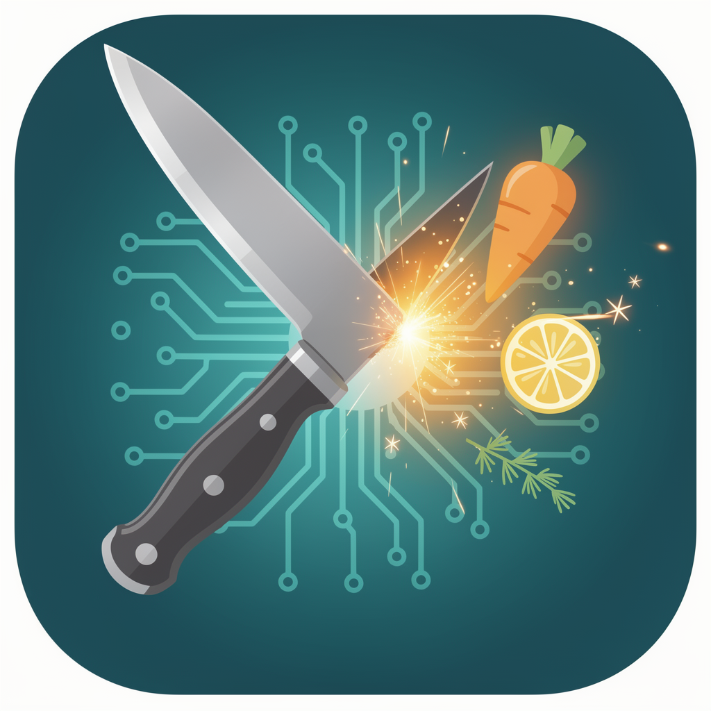
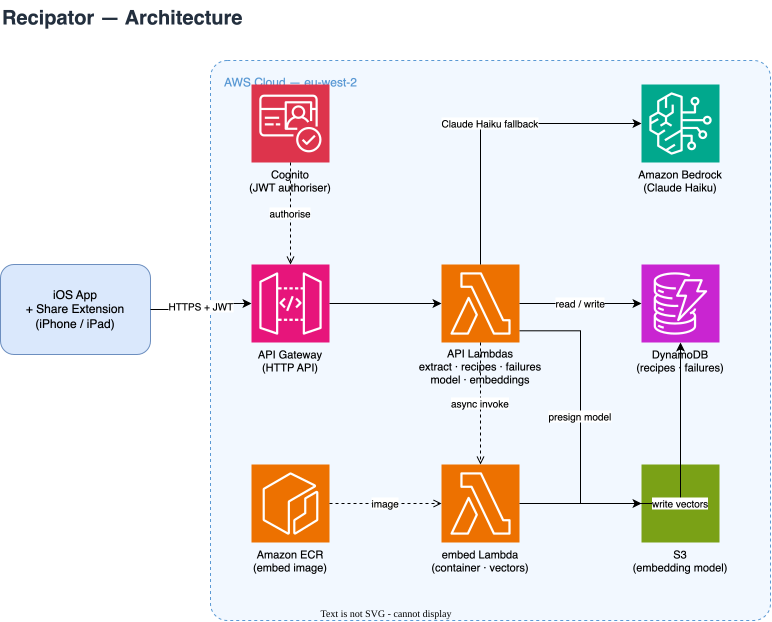

# Recipator — Extract and save recipes from the web with AI

<p align="center">
  
</p>

## Support

If you find this useful, please consider buying me a coffee:

[](https://www.paypal.com/donate?hosted_button_id=Q3BESC73EWVNN&custom=recipator)

## Table of Contents

<!-- toc -->

- [Overview](#overview)
- [Architecture Diagram](#architecture-diagram)
- [Repository Layout](#repository-layout)
- [Stack](#stack)
- [Getting Started](#getting-started)
  * [Prerequisites](#prerequisites)
  * [Setup](#setup)
  * [Architecture Diagrams](#architecture-diagrams)
- [Support](#support)

<!-- tocstop -->

## Overview

Recipator lets you share any recipe URL from Chrome on iPhone, iPad, or desktop and save it as a clean Markdown file — ingredients and method, no adverts, no life stories. It extracts structured data (schema.org/Recipe) when available, and falls back to Claude Haiku for everything else.

## Architecture Diagram



## Repository Layout

| Directory | Contents |
|---|---|
| `ios/` | iOS app + Share Extension (Swift/SwiftUI) |
| `ios/Recipator/` | SwiftUI app — recipe list and viewer |
| `ios/RecipatorShare/` | Share Extension — receives URLs from Chrome/Safari |
| `ios/Shared/` | Swift code shared between app and extension |
| `ios/RecipatorTests/` | XCTest unit tests |
| `ios/assets/` | App icon and design assets |
| `ios/project.yml` | XcodeGen spec — source of truth for the Xcode project |
| `infra/` | AWS CDK (TypeScript) — API Gateway, Lambda, DynamoDB |
| `docs/architecture/` | draw.io architecture diagram and generated SVG |

## Stack

- **iOS app + Share Extension** — Swift 5.10, SwiftUI, iOS 17+
- **API** — API Gateway HTTP API, Lambda (Node 22), `api.recipator.[sandbox.]nakomis.com`
- **Recipe extraction** — schema.org/Recipe JSON-LD first; Claude Haiku fallback
- **Storage** — DynamoDB (AWS backend); local App Group files (spike only)
- **Auth** — Cognito JWT (shared nakomis user pool); API GW validates natively
- **Desktop** — Chrome extension (planned)

## Getting Started

### Prerequisites

- Xcode 15+
- [XcodeGen](https://github.com/yonaskolb/XcodeGen): `brew install xcodegen`
- An [Anthropic API key](https://console.anthropic.com/)

### Setup

```bash
git clone git@github.com:nakomis/recipator.git
cd recipator/ios
cp Shared/Secrets.swift.example Shared/Secrets.swift
# Edit Shared/Secrets.swift and fill in your Anthropic API key (spike only — superseded by backend)
xcodegen generate
open Recipator.xcodeproj
```

Plug in a device, select it as the destination, and run. The Share Extension will appear in Chrome's share sheet once the app is installed.

### Architecture Diagrams

`docs/architecture/recipator.drawio` is the source for the diagram above.
The SVG is auto-regenerated on commit by the pre-commit hook in `.githooks/pre-commit`.

To activate the hook after cloning:

```bash
git config core.hooksPath .githooks
```

## Support

If you find this useful, please consider buying me a coffee:

[](https://www.paypal.com/donate?hosted_button_id=Q3BESC73EWVNN&custom=recipator)
